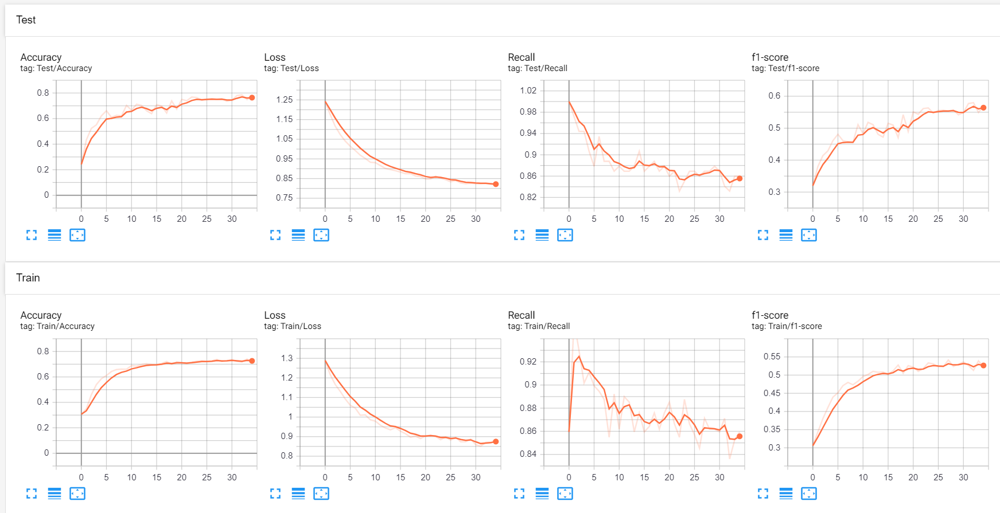
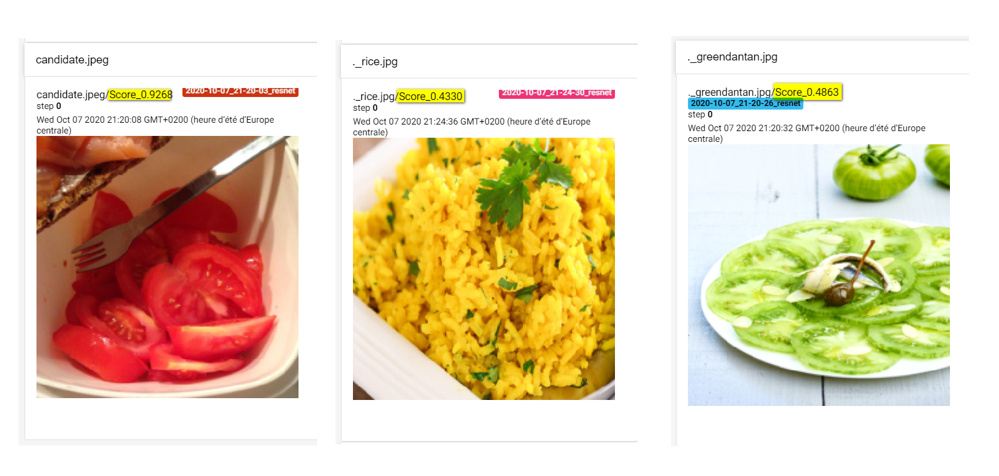

# Home assignment - Proposal details

This is my solution proposal for the home assignment from Foodvisor. The original description can be found [here](https://github.com/Foodvisor/home-assignment/blob/master/README.md).


---
Quick jump to:
- [Design and implementation choices](#design-and-implementation-choices)
    - [The problem](#the-problem)
    - [Exploratory data analysis](#exploratory-data-analysis)
    - [Model design](#model-design)
    - [Results](#results)
    - [Possible improvements](#possible-improvements)
- [Running the code](#running-the-code)
    - [Environment and setup](#environment-and-setup)
    - [Training](#training)
    - [Testing](#testing)
- [Credits](#credits)

---

## Design and implementation choices

### The problem

The problem at hand is to give a binray response yes/no when faced with an image, according to whether or not there is a tomato in the image.

To solve this problem, we are given a set of annotated images that give coordinates of bounding boxes of various types of food and ingredients.

Two main approaches seem suited for this problem, with both advantages and drawbacks.

1. Treat this as a classification problem
    - ultimately, our response variable is binary, and it seems natural to predict a confidence score that a given image is or is not a tomato
    - it is relatively easy to collapse the information about bounding boxes into a binary yes/no if each image has *at least one* bounding box of class tomato.
    - a drawback is that we lose a decent amount of information (precise locations of tomatoes) and it is not immediately clear whether the model will be able to learn/generalise on images *containing* tomatoes (and maybe only on a small part of the image) as opposed to images *of* tomatoes.
    - a patch extraction (from bounding boxes) approach could be considered

2. Treat this as an object detection/image segmentation problem
    - this would imply that the result of the object detection model is not our final goal - we'd need an extra component that translate having a positive detection in an image to the binary yes/no of having tomatoes
    - we leverage precise bounding boxes, but improving AP (or other metrics) may not be ultimately significant because detection is an intermediary product and added precision may not translate into better classification accuracy.

In the interest of time, only the first approach is explored in this repository.

### Exploratory data analysis

A brief EDA was conducted, with a jupyter notebook available in `./notebooks/EDA.ipynb`.

The main focus was to get a good comprension of the structure of the annotations. Two important points are to be discussed:
1. 13 classes are imediately relevant to the problem (instead of just tomatoes). They include derivatives like tomato juice which seem important to monitor in the context of allergies.

2. There is a moderate class imabalance (there are 737 tomato-related ingredients in 534 photos out of 3000 total photos). This brings us to consider how to split our dataset. A random 80/20 split could lead to having very few positive examples in our test set - which would encourage a model to predict "no tomatoes" all the time (disastrous in the context of an allergy).

Unless I'm mistaken, we also learn that there is no specific annotation indicating whether an image belongs to the training/test set, so we will have the responsibility of splitting this 3000-image dataset.

### Model design

A transfer learning approach was used and SqueezeNet (usually good for CAM/Grad-CAM illustrations), ResNet-152 models were added. The choice is left to the user whether to finetune only the last layer (models pretrained on ImageNet from the torchvision Model Zoo) or to retrain from scratch on these familiar architectures.  
For the following results, the ResNet (pretained) model was used as it showed somewhat better results.

The dataset was used with the concerns described in the previous section - a stratified split was performed to have the same label class distribution in both training and test sets.

The dataloader for the training set is designed to perform data augmentation - some transformations are relevant (a dish should be flip-agnostic and some brightness/contrast jitter can be expected from smartphone photos).

The optimizer used was `SGD` (LR = 0.0005), as it showed somewhat better performance compared to `Adam` in my limited experiments.

The loss function used was `BCELossWithLogits` - a well suited loss function for binary classification problems. While `BCELoss` was initially used, `BCELossWithLogits` has the advantage of allowing to easily weigh the loss for underrepresented classes.  
I gave it a weight of 6 to account for the 6 to 1 imbalance. This improved the results drastically, as it allowed the model to stop trying to predict 'no' all the time (local maxima for accuracy with little effort).

### Results

Plots of the training and test accuracies are included below. They also include plots of our (weighted) loss, but also of the recall and f1-score, which are important in this context (if there is an allergy, we may want to have a high recall at the expense of a lower accuracy).



Some sample out-of-dataset images were tested with expected results: a clear red tomato is assigned a high confidence score, rice a lower one and the "green d'antan" tomatoes (green) are barely misclassified. This may be because it is out of distribution due to having few green tomatoes in our dishes.



### Possible improvements

A great number of improvements can be considered for this problem:
- Implementing the alternative solutions described earlier in the problem specification
- Better models, e.g. the [Vision Transformer](https://openreview.net/pdf?id=YicbFdNTTy) submitted to ICLR 2021, like with [this impementation](https://github.com/lucidrains/vit-pytorch).
- More hyperparameter tuning
- A better class selection (there might be dishes containing tomatoes without "tomato" in their name)
- etc.

---

## Running the code/tests
### Environment and setup

This code was tested using Python 3.7.6 and on Windows.

You may use the supplied `requirements.txt` file to install the required dependancies.  
For example, with `pip`※:
```
pip install -r requirements.txt
```

You can also run this within a virtual env or conda environment.

Please note this requirements file indicates on which environment this code was tested. It is probable that newer versions of these packages are compatible, but they may also break compatibility.

### Training
You may retrain a model using the `main.py` file, which offers a plethora of options and hyperparameters for you to choose from.

Before attempting to do so, please make sure you have downloaded the annotations and images according to the following structure:

```
home-assignment
│   ...
│
├───dataset
│   │   img_annotations.json
│   │   label_mapping.csv
│   │
│   └───assignment_imgs
│           ...
```

To retrain a similar model to the one included in the releases, please run 

```
python main.py -p
```

This will rerun a training using the same settings as I've found to work best in my limited testing (I have set the default values accordingly).

For help with the options, you may use the `--help` command:

```
python main.py -h
```

which will display a pseudo-man:
```
usage: Tomato allergies trainer [-h] [-c {yes,no,default}] [-i CUDA_DEVICE]
                                [-m {logistic,squeezenet,resnet,transformer}]
                                [-p] [-o {sgd,adam}] [-e EPOCHS] [-r LR]
                                [-d WEIGHT_DECAY] [-b BATCH_SIZE]
                                [-s IMAGE_SIZE] [-w WEIGHTS_SAVE_PATH]
                                [-t TEST] [-l LOGDIR] [-g RANDOM_SEED]

optional arguments:
  -h, --help            show this help message and exit
  -c {yes,no,default}, --use-cuda {yes,no,default}
                        Use cuda for pytorch models
  -i CUDA_DEVICE, --cuda-device CUDA_DEVICE
                        If cuda-enabled, ID of GPU to use
  -m {logistic,squeezenet,resnet,transformer}, --model-name {logistic,squeezenet,resnet,transformer}
                        Model class name
  -p, --pretrained      Whether to use a pretrained model on ImageNet
  -o {sgd,adam}, --optimizer-name {sgd,adam}
                        Optimizer criterion name
  -e EPOCHS, --epochs EPOCHS
                        Number of epochs for train mode
  -r LR, --lr LR        Learning rate for train mode
  -d WEIGHT_DECAY, --weight-decay WEIGHT_DECAY
                        Weight decay (L2 penalty-based regularization)
  -b BATCH_SIZE, --batch-size BATCH_SIZE
                        Image batch size
  -s IMAGE_SIZE, --image-size IMAGE_SIZE
                        Resizing images to this size (e.g. 227 for SqueezeNet)
  -w WEIGHTS_SAVE_PATH, --weights-save-path WEIGHTS_SAVE_PATH
                        Weights save path for training (w) and predicting (r)
  -t TEST, --test TEST  Image to test a trained model on - outputs True if
                        contains a tomato
  -l LOGDIR, --logdir LOGDIR
                        Log directory for Tensorboard
  -g RANDOM_SEED, --random-seed RANDOM_SEED
                        Random seed for train/test splitting
```

#### Tensorboard
You may view the training/validation metrics (accuracy, loss, recall, F1-score) on Tensorboard. To do so, please run:
```
tensorboard --logdir logs
```
or replace `logs` with the value you have used for `-l LOGDIR` when you ran `main.py`.

If you are running on a headless server, you may need to expose your ports using the `--bind_all` flag.

Once configured, you may access Tensorboard by browsing to `localhost:6006` or `<your remote server ip>:6006`.

### Testing

Weights are by default saved in the working folder as `tomato-predictor.pt`, unless you changed this with the `-w WEIGHTS_SAVE_PATH` flag.

To test a trained model on a custom image, please make sure this `tomato-predictor.pt` file (or the value of `WEIGHTS_SAVE_PATH`) exists, and call `main.py` with the `--test` FLAG followed by the path to your image.

If you are running tests without having re-trained the model, please download `tomato-predictor.pt` from the releases of this repository, and run:

```
python main.py -t <your image>
```

This will call the `has_tomatoes()` function and return True if there is a tomato-related ingredient in your picture. A confidence score in [0,1] will also be printed.

You may use the `has_tomatoes()` function by itself (returning a boolean), however you will have to call it with a `Hyperparameters` object, or a class mimicking a few required members.  
Notably:
- hps.test (path to the candidate image to test)
- hps.weights_save_path (path to the model weights)
- hps.model (of the same model saved in the weights, import it from the `models/` folder)
- hps.image_size (to know the base size to which the image will be resized)
- hps.use_cuda (`True` if you want to use cuda)
- hps.cuda_device (if `hps.use_cuda=True`, the name of your device)
- hps.writer (a torch.utils.tensorboard.SummaryWriter object)

You may view and track the results of your experiments on Tensorboard (see [this section](#tensorboard)), which will give you the following outputs in the `IMAGES` tab (image edited to fit results side-by-side):


### Note
※ Please make sure you're running the commands in the base `home-assignment` directory.

---
## Credits

This code relies on the `numpy`, `pandas`, `Pillow`, `scikit-learn` and `tensorboard` libraries and was implemented with the PyTorch framework.

The PyTorch [documentation](https://pytorch.org/docs/stable/) was used a decent amount and this project may have been (unconsciously) inspired by my previous projects [[1](https://github.com/sylvainma/Summarizer), [2](https://github.com/msaintja/CheXpert-policies)] or assignments from [CS7643](https://www.cc.gatech.edu/classes/AY2020/cs7643_spring/)/[CS231n](http://cs231n.stanford.edu/2019/).